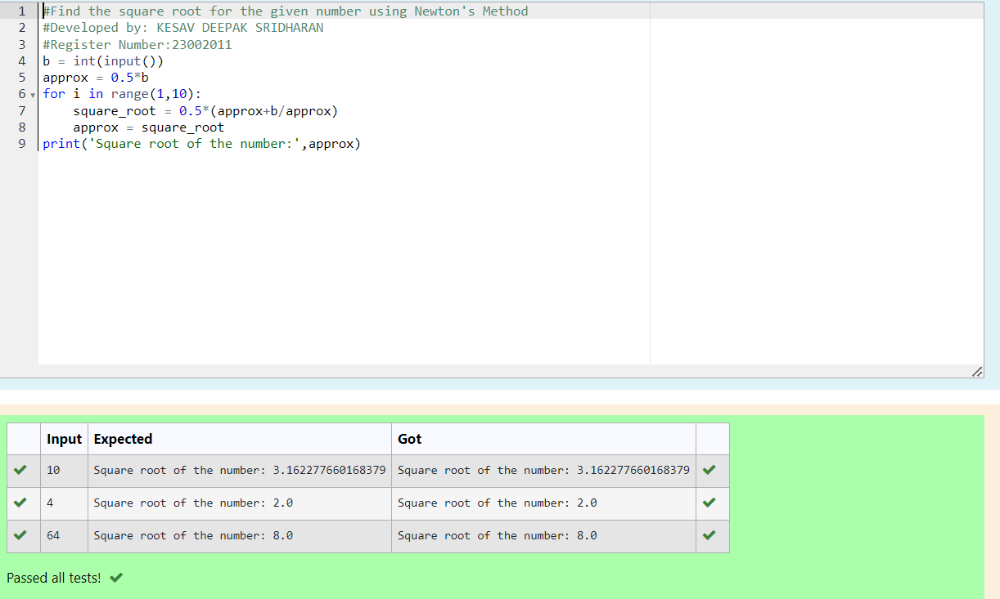

# Find the square root of a number

## AIM:
To write a program to find the square root of a number.

## Equipments Required:
1. Hardware – PCs
2. Anaconda – Python 3.7 Installation / Moodle-Code Runner

## Algorithm
1. Define a function.
2. Get input from the user and assign as b.
3. Set approx = 0.5*b.
4. Using for() loop ,calculate square_root = 0.5 * (approx + b / approx) for 9 iterations.
5. Assign approx = square_root and print approx.
6. End the program.

## Program:
```python
#Find the square root for the given number using Newton's Method
#Developed by: KESAV DEEPAK SRIDHARAN
#Register Number:23002011
b = int(input())
approx = 0.5*b
for i in range(1,10):
    square_root = 0.5*(approx+b/approx)
    approx = square_root
print('Square root of the number:',approx)
```

## Output:



## Result:
Thus the program to find the square root for the given number(newton's method) using function is written and verified using python programming.
